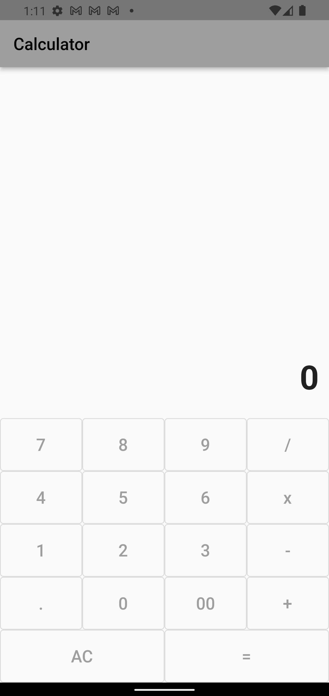

# Flutter project

> ## **Flutter Calculator** 
---

- `แอปพลิเคชันคำนวณ บวก ลบ คูณ หาร`

---
> ## **with Package**
---
- `math_expressions`

---
> ### _รูปลักษณ์ภายในแอปพลิเคชัน_
---
-  หน้าจอแสดงข้อมูล 
---
